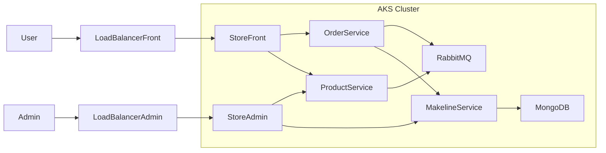

# BestBuy Cloud-Native Microservices – AKS Deployment

**CST8915 – Full-stack Cloud-native Development**

---

## Links

<div align="left">

- [Main Repository](https://github.com/shap0011/bestbuy-cloud-native-aks)
- [Docker Images](https://hub.docker.com/repository/docker/dockeridolgadh2022/makeline-service/general)
- [Kubernetes Manifests]()
- [Deployed Store Front](http://4.239.161.203/)
- [Deployed Store Admin](http://4.239.162.36/)
- [Video Demo]()

</div>

---

## Student Information

- **Name:** Olga Durham
- **Student ID:** 040687883
- **Course:** CST8915 – Full-Stack Cloud-Native Development
- **Semester:** Fall 2025

---

## Technologies (At a Glance)

- Microservices (Node.js, Rust, Go)
- AKS (Azure Kubernetes Service)
- MongoDB StatefulSet (3 replicas + PVC per pod)
- RabbitMQ StatefulSet (persistent queues)
- RabbitMQ + MongoDB custom images
- Ingress via LoadBalancer
- Custom DockerHub images (dockeridolgadh2022/...)

---

## 1. Project Overview

This project is a cloud-native microservices application deployed on **Azure Kubernetes Service (AKS)** and re-themed as a **Best Buy–style online store**.

The original architecture comes from the “Algonquin Pet Store (On Steroids)” sample, but in this project:

- The **branding, UI text, and styling** were updated to match a Best Buy–inspired look and feel.
- The **products, images, and colors** were customized away from “pet toys” toward an electronics retail experience.
- The same microservices architecture (product, order, makeline, RabbitMQ, MongoDB) is reused under a new Best Buy scenario.

This project demonstrates:

- Containerization (Docker)
- Microservices architecture
- Kubernetes deployments (AKS)
- StatefulSets & persistent storage
- Scaling & resilience
- A fully themed Best Buy–style front-end and admin UI

---

## 2. Architecture Overview

### System Architecture Diagram



---

## 3. Microservices Overview

| Service              | Description                                       | Image                                     |
| -------------------- | ------------------------------------------------- | ----------------------------------------- |
| **Product Service**  | Returns product list and product details          | `dockeridolgadh2022/product-service:dev`  |
| **Order Service**    | Receives customer orders, sends messages to queue | `dockeridolgadh2022/order-service:dev`    |
| **Makeline Service** | Processes queued orders, stores them in MongoDB   | `dockeridolgadh2022/makeline-service:dev` |
| **Store Front**      | Customer UI to order products                     | `dockeridolgadh2022/store-front:dev`      |
| **Store Admin**      | Back-office UI to monitor orders                  | `dockeridolgadh2022/store-admin:dev`      |
| **MongoDB**          | Stores processed orders                           | StatefulSet                               |
| **RabbitMQ**         | Message broker for order workflow                 | StatefulSet                               |

---

## 4. Public URLs (LoadBalancer IPs)

| Component                     | URL                                            |
| ----------------------------- | ---------------------------------------------- |
| **Store Front (Customer UI)** | [http://4.239.161.203/](http://4.239.161.203/) |
| **Store Admin (Admin UI)**    | [http://4.239.162.36/](http://4.239.162.36/)   |

Both are publicly accessible through AKS LoadBalancer services.

---

## 5. Docker Images Used

All custom images were pushed to Docker Hub:

dockeridolgadh2022/product-service:dev<br/>
dockeridolgadh2022/order-service:dev<br/>
dockeridolgadh2022/store-front:dev<br/>
dockeridolgadh2022/store-admin:dev<br/>
dockeridolgadh2022/makeline-service:dev<br/>

These images were then referenced inside the Kubernetes Deployment manifests.

---

## 6. Deployment to AKS

### Task 1 — Deploying All Services

All microservices were deployed using:

```
kubectl apply -f aps-all-in-one.yaml
```

This created:

- Deployments for each service
- Services (ClusterIP, LoadBalancer)
- RabbitMQ + MongoDB (simple StatefulSet)

Everything was verified with:

```
kubectl get pods
kubectl get services
```

---

## 7. Task 2 — Adding Persistent Storage & Scaling

### 7.1 Scaling MongoDB to 3 Replicas

A new `aps-all-in-one-Task2.yaml` file was created with:

- **MongoDB StatefulSet scaled to 3 pods**
- **Persistent Volume Claims (PVCs)** for each replica (5Gi each)

Verification:

```
kubectl get statefulset
kubectl get pvc
kubectl get pods
```

Result:

- mongodb-0
- mongodb-1
- mongodb-2

Each had its own persistent volume.

### 7.2 RabbitMQ Persistent Storage

RabbitMQ also received:

- A `volumeClaimTemplate`
- 5Gi persistent volume for message durability

---

## 8. Testing the System

### 8.1 Test Product Service

```
kubectl exec -it curlpod -- curl http://product-service:3002/
```

### 8.2 Test Order Creation (From Store Front)

Open:<br/>
http://4.239.161.203/

- Add item to cart
- Place order

Order goes → RabbitMQ → Makeline → MongoDB → visible in Store Admin

### 8.3 Confirm Order Saved in MongoDB

Inside makeline logs:

```
kubectl logs deployment/makeline-service
```

---

## 9. Removing AI Service (Not Needed)

The original professor template included an unused **AI microservice**, which was removed by:

- Deleting it from Kubernetes YAML
- Removing AI_SERVICE_URL or setting it to empty ("")
- The system now runs cleanly without AI dependencies.

---

## 10. Challenges & Solutions

### 1. StatefulSet Cannot Update Certain Fields

Kubernetes forbids modifying immutable StatefulSet fields.

Fix:
Delete old StatefulSets but preserve data volumes:

```
kubectl delete statefulset mongodb --cascade=orphan
kubectl delete statefulset rabbitmq --cascade=orphan
```

Re-apply YAML to recreate StatefulSets safely.

### 2. AI Service Causing CrashLoopBackoff

Environment variables required Azure secrets.<br/>
Removing the AI service solved all issues.

### 3. LoadBalancer Required Several Minutes to Assign Public IP

Just a wait-time issue — resolved automatically.

### 4. RabbitMQ Needed InitContainer Wait Logic

Used:

```
initContainers:
  - name: wait-for-rabbitmq
    image: busybox
    command: ["sh","-c","until nc -zv rabbitmq 5672; do echo waiting; sleep 2; done;"]
```

Prevented Order Service from failing on startup.

---
