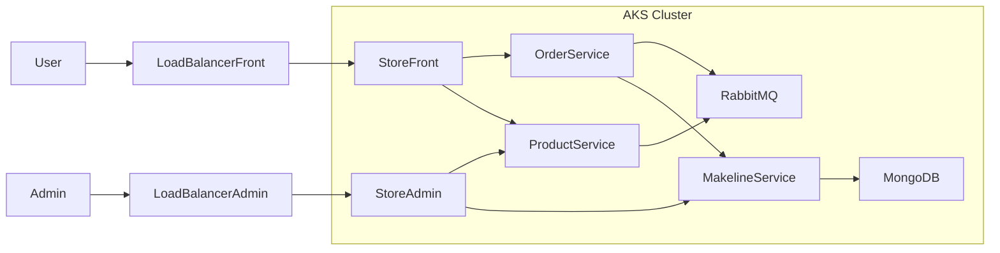

# BestBuy Cloud-Native Microservices – AKS Deployment

**CST8915 – Full-stack Cloud-native Development**

---

## Student Information

- **Name:** Olga Durham
- **Student ID:** 040687883
- **Course:** CST8915 – Full-Stack Cloud-Native Development
- **Semester:** Fall 2025

---

## 1. Project Overview

This project is a cloud-native microservices application deployed on **Azure Kubernetes Service (AKS)** and re-themed as a **Best Buy–style online store**.

The original architecture comes from the “Algonquin Pet Store (On Steroids)” sample, but in this project:

- The **branding, UI text, and styling** were updated to match a Best Buy–inspired look and feel.
- The **products, images, and colors** were customized away from “pet toys” toward an electronics retail experience.
- The same microservices architecture (product, order, makeline, RabbitMQ, MongoDB) is reused under a new Best Buy scenario.

This project demonstrates:

- Containerization (Docker)
- Microservices architecture
- Kubernetes deployments (AKS)
- StatefulSets & persistent storage
- Scaling & resilience
- A fully themed Best Buy–style front-end and admin UI

---

## 2. Architecture Overview

### System Architecture Diagram

---

## 3. Microservices Overview

| Service              | Description                                       | Image                                     |
| -------------------- | ------------------------------------------------- | ----------------------------------------- |
| **Product Service**  | Returns product list and product details          | `dockeridolgadh2022/product-service:dev`  |
| **Order Service**    | Receives customer orders, sends messages to queue | `dockeridolgadh2022/order-service:dev`    |
| **Makeline Service** | Processes queued orders, stores them in MongoDB   | `dockeridolgadh2022/makeline-service:dev` |
| **Store Front**      | Customer UI to order products                     | `dockeridolgadh2022/store-front:dev`      |
| **Store Admin**      | Back-office UI to monitor orders                  | `dockeridolgadh2022/store-admin:dev`      |
| **MongoDB**          | Stores processed orders                           | StatefulSet                               |
| **RabbitMQ**         | Message broker for order workflow                 | StatefulSet                               |

---

## 4. Public URLs (LoadBalancer IPs)

| Component                     | URL                                            |
| ----------------------------- | ---------------------------------------------- |
| **Store Front (Customer UI)** | [http://4.239.161.203/](http://4.239.161.203/) |
| **Store Admin (Admin UI)**    | [http://4.239.162.36/](http://4.239.162.36/)   |

Both are publicly accessible through AKS LoadBalancer services.

---

## 5. Docker Images Used

All custom images were pushed to Docker Hub:

dockeridolgadh2022/product-service:dev 
dockeridolgadh2022/order-service:dev 
dockeridolgadh2022/store-front:dev 
dockeridolgadh2022/store-admin:dev 
dockeridolgadh2022/makeline-service:dev 

---
